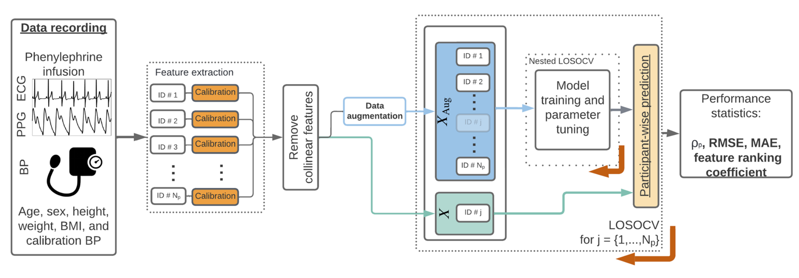

# Features from the photoplethysmogram and the electrocardiogram for estimating changes in blood pressure


## Structure
``` 
├── /bp_est_ppg_ecg/                     # BP estimation using PPG and ECG features
│   ├── /__init__.py      
│   ├── /Dataset_utils.py      		 # Classes to handle datasets for blood pressure (BP) estimation.
│   ├── /MOLLIE_session.py               # Class specific to the MOLLIE clinical study -- NO participant identifying information is present in this file
│   ├── /regression_model_funcs.py       # Regression models
│   ├── /run_LOSOCV.py      		 # Run Leave One Subject Out (LOSOCV) CV
├── /example_data 	                 # example data  
├── /tests                               # Unit tests
├── requirements.txt                     # configs file 
└── README.md
```
## bp_est_ppg_ecg

This repo contains code to estimate BP using features from the PPG and ECG following the methodology detailed below:

<p float="center">
  
  <b>Figure -</b> <em> OSchematic of the Delta BP estimation pipeline for each of the proposed models. We extracted features from the PPG and ECG and averaged their values within a window of size 40s centred on times of cuff inflations. We then implemented a hybrid calibration approach such that the proposed models estimate Delta BP from a baseline calibration value determined during the rest period. Data augmentation was implemented to increase the training and validation set size by interpolating between cuff inflations. Models were trained and evaluated in a nested leave-one-subject-out cross-validation (LOSOCV) framework shown here by the iterator j which indicates the test participant for that iteration. Participant j was then removed from the training/ validation set (XAug) for that iteration. </em>
</p>

See **`run_LOSOCV.py`** to run BP estimation using the example data. 

## Example data

Some example data of ECG and PPG features have have been supplied to assist in understanding this codebase. This data is in .csv format. Additionally, example participant demographics.csv file has been provided. Due to data privacy, this data is NOT from the clinical trial we ran as part of our work - the demographics file does not represent any individuals.

## License

This project is licensed under the [MIT License](LICENSE).

## <a name="cite"/> :clipboard: Citation

If you use this code in your research, please consider citing our paper:
```
@article{Finnegan2023,
               title = {{Features from the photoplethysmogram and the electrocardiogram for estimating changes in blood pressure}},
               author = {Finnegan, Eoin and Davidson, Shaun and Harford, Mirae and Watkinson, Peter and Tarassenko, Lionel and Villarroel, Mauricio},
               journal = {Scientific Reports},
               month = {jan},
               number = {1}, 
               pages = {1--20},
               volume = {13},
               year = {2023}}

```

## Contact

If you have any questions or comments, please contact the authors at eoin.finnegan@stx.ox.ac.uk


