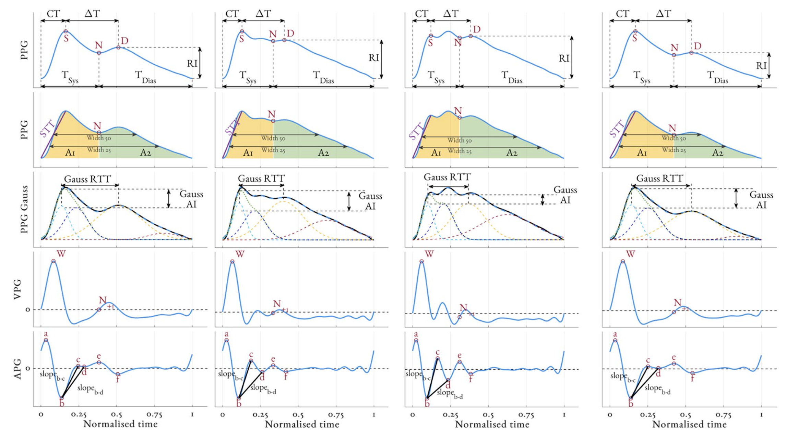

# Features from the photoplethysmogram and the electrocardiogram for estimating changes in blood pressure


## Structure
'''
├── /+func/                       # All functions
│   ├── /+aux_functions/      # ancillary/helper functions
│   ├── /+ecg/      		# ECG functions
│   ├──/+HRV/              	# Heart rate variability functions
│   ├── /+pat/       		# PAT functions
│   ├── /+plot/      		# Plotter functions
│   ├──/+pulsew/              	# PPG functions
│   ├──/+waveform/              # Waveform/timeseries functions
├── /example_data 	# example data  
├── example_feature_extraction.m                     # tutorial file 
├── return_configs.m                     # configs file 
└── README.md
'''

## Dependencies 
- MATLAB R2020b (v9.9)                              
- Signal Processing Toolbox           
- Statistics and Machine Learning Toolbox 

## Feature extraction

Multiple features were extracted from the PPG and ECG waveforms. 
<p float="center">
  
  <b>Figure -</b> <em> Overview of the fiducial points detected and some of the features extracted from the PPG waveform for one individual (Male, Age: 24, BMI: 25.1) during the four stages of the study protocol: (a) rest, (b) dose increase, (c) maximum infusion, and (d) washout. Examples of the following features are provided: Crest time (CT), DeltaT, reflection index (RI), width25, width50, slope transit time (STT), A1, A2, Gaussian estimation of
the transit time of the reflected wave (Gauss RTT) and augmentation index (Gauss AI), slopeb-c and slopeb-d. Acronyms: S - Systolic peak, N - Dicrotic notch, D - Diastolic peak, a-e - waves of the APG. </em>
</p>

See **`example_feature_extraction.m`** for a tutorial on all feature extraction. 

Toggle
```matlab
flags.plot_ppg_ecg_overview = 0;
flags.plot_ppg_features_overview = 0;
flags.plot_PAT_overview = 0;
```
To plot feature extraction overviews.

## License

This project is licensed under the [MIT License](LICENSE).

## <a name="cite"/> :clipboard: Citation

If you use this code in your research, please consider citing our paper:
```
@article{Finnegan2023,
               title = {{Features from the photoplethysmogram and the electrocardiogram for estimating changes in blood pressure}},
               author = {Finnegan, Eoin and Davidson, Shaun and Harford, Mirae and Watkinson, Peter and Tarassenko, Lionel and Villarroel, Mauricio},
               journal = {Scientific Reports},
               month = {jan},
               number = {1}, 
               pages = {1--20},
               volume = {13},
               year = {2023}}

```

## Contact

If you have any questions or comments, please contact the authors at eoin.finnegan@stx.ox.ac.uk


